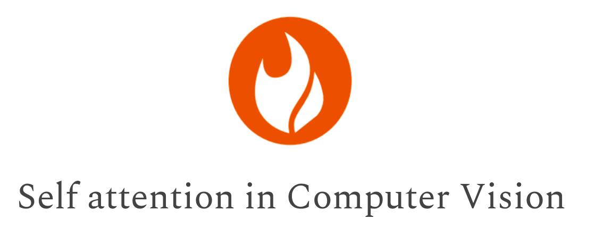

<div align="center">

</div>

# Self-attention building blocks for computer vision applications in PyTorch

Implementation of self attention mechanisms for computer vision in PyTorch with einsum and einops.
Focused on computer vision self-attention modules. 

#### Install it via pip 

```$ pip install self-attention-cv``` 

It would be nice to pre-install pytorch in your environment, in case you don't have a GPU. To run the tests from the terminal 
```$ pytest``` you may need to run ``` export PYTHONPATH=$PATHONPATH:`pwd` ``` before.


## Related articles
- [How Attention works in Deep Learning](https://theaisummer.com/attention/)
- [How Transformers work in deep learning and NLP](https://theaisummer.com/transformer/)
- [How the Vision Transformer (ViT) works in 10 minutes: an image is worth 16x16 words](https://theaisummer.com/vision-transformer/)
- [Understanding einsum for Deep learning: implement a transformer with multi-head self-attention from scratch](https://theaisummer.com/einsum-attention/)
- [How Positional Embeddings work in Self-Attention](https://theaisummer.com/positional-embeddings/)
- [Why multi-head self attention works: math, intuitions and 10+1 hidden insights](https://theaisummer.com/self-attention/)


## Code Examples


#### Multi-head attention

```python
import torch
from self_attention_cv import MultiHeadSelfAttention

model = MultiHeadSelfAttention(dim=64)
x = torch.rand(16, 10, 64)  # [batch, tokens, dim]
mask = torch.zeros(10, 10)  # tokens X tokens
mask[5:8, 5:8] = 1
y = model(x, mask)
```

#### Axial attention

```python
import torch
from self_attention_cv import AxialAttentionBlock
model = AxialAttentionBlock(in_channels=256, dim=64, heads=8)
x = torch.rand(1, 256, 64, 64)  # [batch, tokens, dim, dim]
y = model(x)
```

#### Vanilla Transformer Encoder
```python
import torch
from self_attention_cv import TransformerEncoder
model = TransformerEncoder(dim=64,blocks=6,heads=8)
x = torch.rand(16, 10, 64)  # [batch, tokens, dim]
mask = torch.zeros(10, 10)  # tokens X tokens
mask[5:8, 5:8] = 1
y = model(x,mask)
```
#### Vision Transformer with/without ResNet50 backbone for image classification
```python
import torch
from self_attention_cv import ViT, ResNet50ViT

model1 = ResNet50ViT(img_dim=128, pretrained_resnet=False, 
                        blocks=6, num_classes=10, 
                        dim_linear_block=256, dim=256)
# or
model2 = ViT(img_dim=256, in_channels=3, patch_dim=16, num_classes=10,dim=512)
x = torch.rand(2, 3, 256, 256)
y = model2(x) # [2,10]
```

#### A re-implementation of Unet with the Vision Transformer encoder

```python
import torch
from self_attention_cv.transunet import TransUnet
a = torch.rand(2, 3, 128, 128)
model = TransUnet(in_channels=3, img_dim=128, vit_blocks=8,
vit_dim_linear_mhsa_block=512, classes=5)
y = model(a) # [2, 5, 128, 128]
```

#### Bottleneck Attention block 
```python
import torch
from self_attention_cv.bottleneck_transformer import BottleneckBlock
inp = torch.rand(1, 512, 32, 32)
bottleneck_block = BottleneckBlock(in_channels=512, fmap_size=(32, 32), heads=4, out_channels=1024, pooling=True)
y = bottleneck_block(inp)
```


### Position embeddings are also available

#### 1D Positional Embeddings 

```python
import torch
from self_attention_cv.pos_embeddings import AbsPosEmb1D,RelPosEmb1D

model = AbsPosEmb1D(tokens=20, dim_head=64)
# batch heads tokens dim_head
q = torch.rand(2, 3, 20, 64)
y1 = model(q)

model = RelPosEmb1D(tokens=20, dim_head=64, heads=3)
q = torch.rand(2, 3, 20, 64)
y2 = model(q)
```

#### 2D Positional Embeddings
```python
import torch
from self_attention_cv.pos_embeddings import RelPosEmb2D
dim = 32  # spatial dim of the feat map
model = RelPosEmb2D(
    feat_map_size=(dim, dim),
    dim_head=128)

q = torch.rand(2, 4, dim*dim, 128)
y = model(q)
```

## Acknowledgments
Thanks to Alex Rogozhnikov [@arogozhnikov](https://github.com/arogozhnikov) for the awesome einops package. 
For my re-implementations I have studied and borrowed code from many repositories of Phil Wang [@lucidrains](https://github.com/lucidrains). 
By studying  his code I have managed to grasp self-attention, discover nlp stuff that are never
referred in the papers, and learn from his clean coding style.

### Cited as

```
@article{adaloglou2021transformer,
    title   = "Transformers in Computer Vision",
    author  = "Adaloglou, Nikolas",
    journal = "https://theaisummer.com/",
    year    = "2021",
    howpublished = {https://github.com/The-AI-Summer/self-attention-cv},
  }
```
 
## References

1. Vaswani, A., Shazeer, N., Parmar, N., Uszkoreit, J., Jones, L., Gomez, A. N., ... & Polosukhin, I. (2017). Attention is all you need. arXiv preprint arXiv:1706.03762.
2. Wang, H., Zhu, Y., Green, B., Adam, H., Yuille, A., & Chen, L. C. (2020, August). Axial-deeplab: Stand-alone axial-attention for panoptic segmentation. In European Conference on Computer Vision (pp. 108-126). Springer, Cham.
3. Srinivas, A., Lin, T. Y., Parmar, N., Shlens, J., Abbeel, P., & Vaswani, A. (2021). Bottleneck Transformers for Visual Recognition. arXiv preprint arXiv:2101.11605.  
4. Dosovitskiy, A., Beyer, L., Kolesnikov, A., Weissenborn, D., Zhai, X., Unterthiner, T., ... & Houlsby, N. (2020). An image is worth 16x16 words: Transformers for image recognition at scale. arXiv preprint arXiv:2010.11929.
5. Ramachandran, P., Parmar, N., Vaswani, A., Bello, I., Levskaya, A., & Shlens, J. (2019). Stand-alone self-attention in vision models. arXiv preprint arXiv:1906.05909.
6. Chen, J., Lu, Y., Yu, Q., Luo, X., Adeli, E., Wang, Y., ... & Zhou, Y. (2021). Transunet: Transformers make strong encoders for medical image segmentation. arXiv preprint arXiv:2102.04306.
7. Wang, S., Li, B., Khabsa, M., Fang, H., & Ma, H. (2020). Linformer: Self-attention with linear complexity. arXiv preprint arXiv:2006.04768.
8. Bertasius, G., Wang, H., & Torresani, L. (2021). Is Space-Time Attention All You Need for Video Understanding?. arXiv preprint arXiv:2102.05095.
9. Shaw, P., Uszkoreit, J., & Vaswani, A. (2018). Self-attention with relative position representations. arXiv preprint arXiv:1803.02155.

## Support
If you really like this repository and find it useful, please consider (★) starring it, so that it can reach a broader audience of like-minded people. It would be highly appreciated :) !


